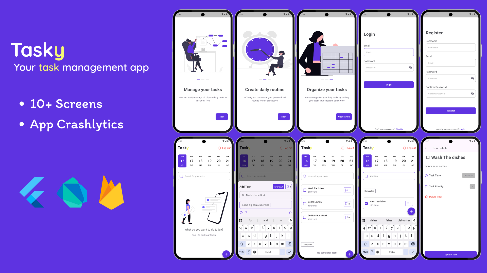

# Tasky ✅

[](https://flutter.dev)
[](https://dart.dev)
[](https://firebase.google.com)

---

## What the project does 🚀

Tasky is a **Flutter-based task management app** that helps you plan and organize your daily tasks with ease. It features a smooth onboarding experience, Firebase-powered authentication, real-time task management backed by Cloud Firestore, and crash monitoring via Firebase Crashlytics.

**Navigation flow:**

```
Splash → Onboarding → Login / Register → Home (Task List) → Task Details
```

---

## Why the project is useful 🌟

- 🔐 **Full authentication flow** — register and login with Firebase Auth, with email & password validation.
- 📝 **Real-time task CRUD** — create, read, update, and delete tasks stored in Cloud Firestore.
- 📅 **Date-based filtering** — browse tasks by day using a horizontal date picker.
- 🎯 **Priority system** — assign priorities (1–10) to tasks, sorted automatically.
- 👆 **Swipe to delete** — slide a task card to remove it instantly.
- 🔍 **Search** — filter tasks by title right from the home screen.
- ✅ **Completed / Uncompleted sections** — toggle tasks between states with a checkbox.
- 💥 **Crash reporting** — Firebase Crashlytics catches both Flutter and async errors.
- ✨ **Polished UI** — animated splash, interactive onboarding, consistent theming, and reusable widgets throughout.

---

## App UI 🖼️



---

## Folder Structure 📁

```
lib/
├── main.dart                          # App entry point & Firebase init
├── firebase_options.dart              # Generated Firebase config
├── core/
│   ├── constants/
│   │   └── app_constants.dart         # Asset paths
│   ├── firebase/
│   │   └── fb_result.dart             # Sealed result type (Success / Failure)
│   ├── theme/
│   │   ├── app_colors.dart            # Centralized color palette
│   │   └── app_fonts.dart             # Shared text styles
│   ├── utils/
│   │   ├── formatter.dart             # Date formatting helper
│   │   └── validator.dart             # Email, password, phone validators
│   └── widgets/
│       ├── app_button.dart            # Reusable button
│       ├── app_dialogs.dart           # Loading, error & success dialogs
│       └── app_text_form_field.dart   # Reusable text field with validation
├── feature/
│   ├── auth/
│   │   ├── data/
│   │   │   ├── firebase/
│   │   │   │   └── fb_auth.dart       # Firebase Auth (register/login/logout)
│   │   │   └── model/
│   │   │       └── user_model.dart    # User data model
│   │   └── view/
│   │       ├── login_screen.dart
│   │       ├── register_screen.dart
│   │       └── widgets/
│   │           └── signing_nav.dart   # Auth navigation toggle
│   ├── home/
│   │   ├── data/
│   │   │   ├── firebase/
│   │   │   │   └── fb_task.dart       # Firestore task CRUD
│   │   │   └── model/
│   │   │       └── task_model.dart    # Task data model with ChangeNotifier
│   │   └── view/
│   │       ├── home_screen.dart       # Main task list with date picker & search
│   │       ├── task_screen.dart       # Task detail / edit / delete view
│   │       └── widgets/
│   │           ├── card_item.dart         # Slidable task card
│   │           ├── empty_state.dart       # Empty task placeholder
│   │           ├── home_app_bar.dart      # App bar with logout
│   │           ├── task_bottom_sheet.dart  # Add-task bottom sheet
│   │           └── task_priority_picker.dart # Priority selector dialog
│   ├── onboarding/
│   │   ├── onboarding_data.dart
│   │   ├── onboarding_screen.dart
│   │   └── widgets/
│   │       ├── custom_animated_widget.dart
│   │       ├── onboarding_button.dart
│   │       └── onboarding_indicator.dart
│   └── splash/
│       └── splash.dart
assets/
└── images/
    ├── icons/       # UI icons (flag, timer, trash, send, search, logout)
    ├── onboarding/  # Onboarding illustrations
    └── splash/      # Splash screen assets
```

---

## Technologies Used 🧰

| Category | Technology |
|---|---|
| Framework | Flutter (Material) |
| Language | Dart |
| Auth | Firebase Auth |
| Database | Cloud Firestore |
| Crash Reporting | Firebase Crashlytics |
| Analytics | Firebase Analytics |
| Animations | animate_do |
| Onboarding Indicators | smooth_page_indicator |
| Date Picker | date_picker_timeline |
| Swipe Actions | flutter_slidable |
| Native Splash | flutter_native_splash |

---

## GitHub Workflow 🔁

| Branch | Purpose |
|---|---|
| `master` | Production-ready releases |
| `develop` | Integration branch for features |
| `feature/*` | Individual feature work |

1. Create a feature branch off `develop` → `feature/your-scope`
2. Open a Pull Request into `develop` for review
3. Merge `develop` into `master` when the release is ready

---

## Skills Learned 🧠

- Integrating **Firebase Auth** (email/password registration & login)
- Performing **Firestore CRUD** operations with typed converters
- Implementing **sealed classes** for result handling (`FbResult<T>`)
- Setting up **Firebase Crashlytics** for Flutter & async error capture
- Building a **feature-first folder structure** with data/view separation
- Creating **reusable widgets** — buttons, text fields, dialogs, cards
- Applying a **centralized theming** system (colors, fonts)
- Form validation with **regex-based validators**
- Using **flutter_slidable** for swipe-to-delete gestures
- Navigating with **named routes** across multiple screens
- Animating UI with **animate_do** and **smooth_page_indicator**


## How Users Can Get Started 🧩

### Prerequisites ✅

- Flutter SDK **3.9** or later
- A Firebase project with **Auth**, **Firestore**, and **Crashlytics** enabled
- The FlutterFire CLI (to generate `firebase_options.dart`)

### Setup ⚙️

```bash
# 1. Clone the repo
git clone https://github.com/Clark605/tasky_nti.git
cd tasky_nti

# 2. Install dependencies
flutter pub get

# 3. Configure Firebase (if regenerating)
flutterfire configure

# 4. Regenerate native splash (optional)
dart run flutter_native_splash:create
```

### Run ▶️

```bash
flutter run
```

### Quick Tour 🧭

1. The app opens with an **animated splash** screen.
2. Swipe through **3 onboarding pages** — tap *Get Started*.
3. **Register** a new account or **Login** with existing credentials.
4. On the **Home** screen, pick a date, tap **+** to add a task with a title, description, due date, and priority.
5. **Swipe left** on a card to delete, or **tap** it to view details, update, or change priority.
6. Toggle the **checkbox** to mark a task complete or incomplete.

---

Built with ❤️ by Clark605.
